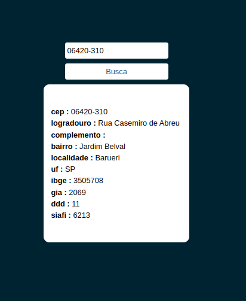
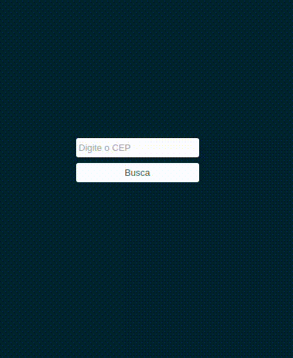

# web_cep_consult

web_cep_consult é uma aplicação web desenvolvida utilizando as tecnologias Next.js, Tailwind CSS e a API ViaCEP. Seu principal objetivo é fornecer uma interface intuitiva para que os usuários possam consultar informações detalhadas de endereços no Brasil a partir de seus respectivos CEPs


## Screenshots



## Instalação

Instale web_cep_consult com npm

```bash
    git clone https://github.com/GabrielLimaG3/web_cep_consult.git

    cd web_cep_consult

    npm install

    npm run dev
```

## Demonstração



    
## Stack utilizada

- Nextjs
- Tailwind CSS